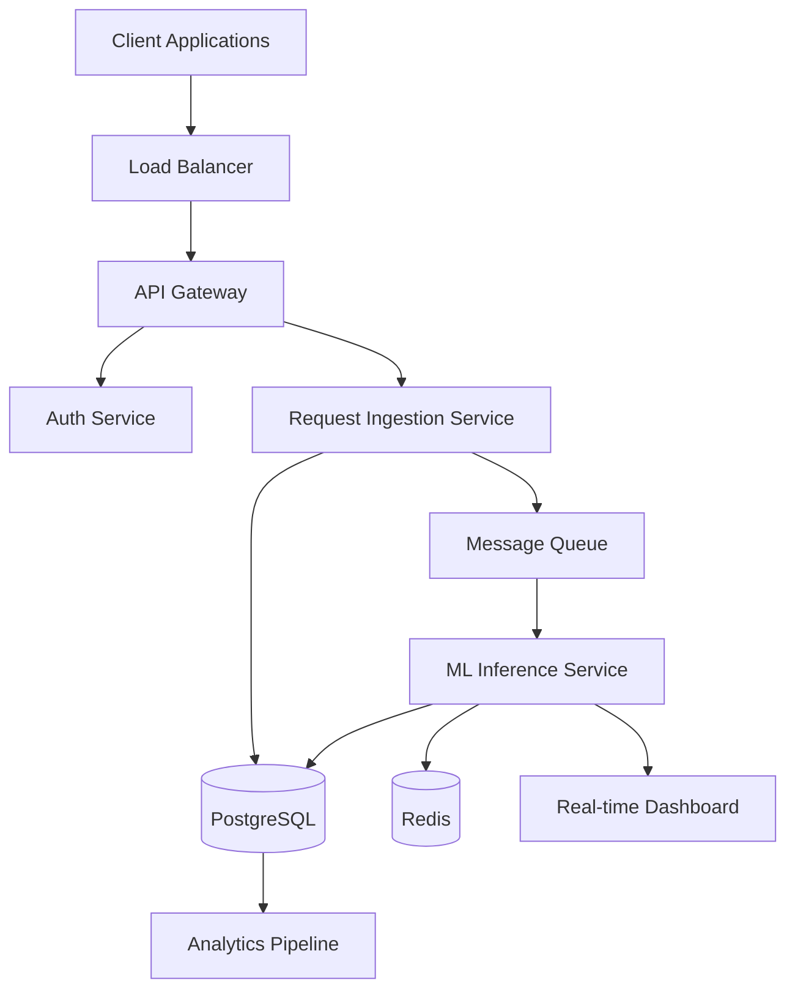

# Example Agent Session: Architecture Phase

This document demonstrates using Cursor Cloud Agents for technical architecture and implementation of Project Aegis.

---

## Scenario

You have Project Aegis MVP working (Express API + ML guide), and now need to design and implement the production architecture for scale.

---

## Session 1: System Architecture Design

### Initial Prompt

```
Design the complete production system architecture for Project Aegis.

Current state:
- Express.js API for webhook ingestion (see src/Index.js)
- ML model concept for risk scoring (see docs/utility-damage-prevention-ml-guide.md)
- Target: Scale to 1000 requests/minute, 99.9% uptime

Requirements:
1. High-level system diagram (use mermaid or text-based)
2. Component breakdown:
   - API Gateway/Load Balancer
   - Request ingestion service
   - ML inference service
   - Data pipeline
   - Storage (databases, object storage)
   - Real-time dashboard
3. Data flow architecture
4. Security architecture (auth, encryption, compliance)
5. Scalability and reliability patterns
6. Deployment architecture (cloud provider: AWS)

Create comprehensive architecture documentation.
```

### Agent Output Structure

The agent would create `docs/system-architecture.md` with:

```markdown
# Project Aegis - System Architecture

## High-Level Architecture



## Component Breakdown

### 1. API Gateway / Load Balancer
- **Technology**: AWS ALB or API Gateway
- **Responsibilities**: 
  - Request routing
  - Rate limiting
  - SSL termination
  - DDoS protection

### 2. Request Ingestion Service
- **Technology**: Express.js (Node.js) - extend current implementation
- **Responsibilities**:
  - Validate incoming webhook requests
  - Signature verification
  - Enqueue for processing
  - Return immediate acknowledgment

### 3. ML Inference Service
- **Technology**: Python FastAPI or SageMaker Endpoint
- **Responsibilities**:
  - Load ML model
  - Feature extraction from requests
  - Risk score calculation
  - Explainability (SHAP values)
  - Store predictions

[... more components]

## Data Flow

1. **Request Ingestion**
   - Webhook received ? Signature verified ? Validated ? Enqueued ? ACK sent

2. **Risk Scoring**
   - Message dequeued ? Features extracted ? ML inference ? Score calculated ? Stored

3. **Real-time Updates**
   - Score stored ? Event emitted ? Dashboard updated ? Alerts triggered (if high risk)

## Security Architecture

- **Authentication**: OAuth2/JWT for API access
- **Webhook Security**: HMAC signature verification (already implemented)
- **Data Encryption**: TLS in transit, AES-256 at rest
- **Network Security**: VPC, security groups, private subnets
- **Compliance**: SOC2 Type II, data residency controls

## Scalability Patterns

- **Horizontal Scaling**: Stateless services, auto-scaling groups
- **Database**: Read replicas, connection pooling
- **Caching**: Redis for frequently accessed data
- **Queue**: SQS/Kafka for async processing
- **CDN**: CloudFront for static assets

## Reliability Patterns

- **High Availability**: Multi-AZ deployment
- **Disaster Recovery**: Automated backups, RTO < 1 hour
- **Monitoring**: CloudWatch, Datadog, or similar
- **Circuit Breakers**: Prevent cascade failures
- **Retry Logic**: Exponential backoff for transient failures
```

---

## Session 2: API Design Extension

### Prompt

```
Based on the system architecture, design a complete REST API for Project Aegis 
that extends my current Express.js implementation.

Current API:
- POST /api/locate-request (webhook ingestion)

New endpoints needed:
1. Risk scoring endpoints
2. Historical data query endpoints
3. Dashboard/analytics endpoints
4. Admin endpoints

Create:
- OpenAPI 3.0 specification
- Request/response schemas with examples
- Authentication requirements
- Rate limiting strategy
- Error response format

Generate the OpenAPI spec and update my Express.js API with the new endpoints.
```

### Agent Output

The agent would:
1. Create `api/openapi.yaml` with full API specification
2. Extend `src/Index.js` with new endpoints
3. Create request/response validation schemas
4. Add authentication middleware
5. Implement rate limiting per endpoint

Example additions:

```javascript
// New endpoints added to src/Index.js

// Risk scoring endpoint
app.post('/api/v1/risk-score', authenticate, async (req, res) => {
  // Calculate risk score for locate request
});

// Historical queries
app.get('/api/v1/locate-requests', authenticate, async (req, res) => {
  // Query historical locate requests with filters
});

// Dashboard analytics
app.get('/api/v1/analytics/risk-trends', authenticate, async (req, res) => {
  // Return risk trend analytics
});
```

---

## Session 3: Database Schema Design

### Prompt

```
Design the complete database schema for Project Aegis covering:

1. Core entities:
   - Locate requests (extend current structure)
   - ML predictions and scores
   - Damage incidents and outcomes
   - Users and organizations
   - Feature store (for ML training)

2. Requirements:
   - Support time-series queries (risk trends over time)
   - Efficient joins for analytics
   - Audit logging
   - Soft deletes for compliance

3. Create:
   - ER diagram (mermaid)
   - SQL schema (PostgreSQL)
   - Migration scripts
   - Indexes for performance
   - Data access layer code (using your preferred ORM)

Technology: PostgreSQL, use Sequelize or Prisma for Node.js.
```

### Agent Output

The agent would create:

1. **ER Diagram** in markdown
2. **Migration files**:
   ```
   database/migrations/
   ??? 001_create_locate_requests.js
   ??? 002_create_predictions.js
   ??? 003_create_damage_incidents.js
   ??? ...
   ```
3. **Models**:
   ```
   src/models/
   ??? LocateRequest.js
   ??? Prediction.js
   ??? DamageIncident.js
   ??? ...
   ```
4. **Indexes** for performance optimization

---

## Session 4: ML Service Implementation

### Prompt

```
Based on my ML guide and system architecture, implement the ML inference service 
for Project Aegis:

1. Technology: Python FastAPI
2. Features:
   - Load pre-trained XGBoost model
   - Feature extraction from locate request data
   - Risk score calculation
   - SHAP explainability
   - Model versioning support
   - Health check endpoint

3. Integration:
   - Accept requests from message queue (SQS/RabbitMQ)
   - Store results in PostgreSQL
   - Emit events for real-time updates

4. Create:
   - FastAPI application structure
   - Feature extraction logic
   - Model inference code
   - Dockerfile for containerization
   - Deployment configuration

Reference my ML guide for feature engineering details.
```

### Agent Output

The agent would create:

```
ml-service/
??? app/
?   ??? main.py          # FastAPI app
?   ??? models/
?   ?   ??? risk_scorer.py
?   ??? features/
?   ?   ??? extractor.py
?   ??? explainability/
?       ??? shap_explainer.py
??? Dockerfile
??? requirements.txt
??? docker-compose.yml
```

---

## Session 5: Infrastructure as Code

### Prompt

```
Create Infrastructure as Code for Project Aegis deployment on AWS:

1. Components needed:
   - VPC with public/private subnets
   - Application Load Balancer
   - ECS/EKS cluster for services
   - RDS PostgreSQL database
   - ElastiCache Redis
   - SQS queues
   - S3 buckets for ML models
   - CloudWatch logging
   - IAM roles and policies

2. Technology: Terraform (preferred) or CloudFormation

3. Create:
   - Main infrastructure configuration
   - Module structure
   - Environment-specific configs (dev/staging/prod)
   - Documentation for deployment

4. Include:
   - Security best practices
   - Cost optimization
   - High availability setup
   - Disaster recovery basics
```

### Agent Output

The agent would create:

```
infrastructure/
??? terraform/
?   ??? main.tf
?   ??? variables.tf
?   ??? outputs.tf
?   ??? modules/
?   ?   ??? vpc/
?   ?   ??? ecs/
?   ?   ??? rds/
?   ?   ??? ...
?   ??? environments/
?       ??? dev/
?       ??? staging/
?       ??? prod/
??? README.md
??? deployment-guide.md
```

---

## Session 6: CI/CD Pipeline

### Prompt

```
Create CI/CD pipeline configuration for Project Aegis:

1. Requirements:
   - GitHub Actions (or GitLab CI/CD)
   - Automated testing (unit, integration)
   - Docker image building
   - Security scanning
   - Deployment to AWS (dev ? staging ? prod)
   - Rollback capability

2. Include:
   - Test workflows
   - Build workflows
   - Deployment workflows
   - Notification on failures

3. Create:
   - GitHub Actions workflows
   - Docker build configurations
   - Deployment scripts
   - Environment configuration management
```

### Agent Output

The agent would create:

```
.github/
??? workflows/
    ??? test.yml
    ??? build.yml
    ??? deploy-dev.yml
    ??? deploy-staging.yml
    ??? deploy-prod.yml

scripts/
??? deploy.sh
??? rollback.sh
```

---

## Session 7: Monitoring & Observability

### Prompt

```
Design monitoring and observability for Project Aegis:

1. Metrics to track:
   - API latency and throughput
   - ML inference latency
   - Error rates
   - Risk score distributions
   - Business metrics (requests processed, high-risk alerts)

2. Logging:
   - Structured logging (JSON)
   - Log aggregation
   - Error tracking

3. Alerting:
   - Service health alerts
   - Error rate thresholds
   - Business metric alerts

4. Create:
   - CloudWatch dashboards (or Datadog/Grafana)
   - Alert configurations
   - Logging standards
   - Observability documentation

Technology: CloudWatch, or integrate Datadog/New Relic.
```

### Agent Output

The agent would create:
- Dashboard configurations
- Alert definitions
- Logging standards document
- Observability runbook

---

## Complete Architecture Deliverables

After these sessions, you'd have:

? **System Architecture Document**
- High-level design
- Component specifications
- Data flow diagrams
- Security architecture

? **API Specification**
- OpenAPI spec
- Extended Express.js implementation
- Authentication/authorization

? **Database Schema**
- ER diagrams
- Migration scripts
- Data models
- Performance optimizations

? **ML Service**
- FastAPI implementation
- Feature extraction
- Model inference
- Explainability

? **Infrastructure**
- Terraform/CloudFormation code
- Multi-environment setup
- Security configurations

? **CI/CD Pipeline**
- GitHub Actions workflows
- Automated testing
- Deployment automation

? **Monitoring**
- Dashboards
- Alerts
- Logging standards

**Total Time:** ~4-6 hours of agent interaction  
**Your Effort:** Review, test, and refine  
**Output Quality:** Production-ready architecture

---

## Tips from This Example

1. **Reference Existing Code**: Always point to current implementation
2. **Incremental Build**: Build components one at a time
3. **Integration Points**: Specify how components connect
4. **Constraints Matter**: Include scalability, cost, compliance requirements
5. **Test as You Go**: Ask for tests with each component

---

## Next Steps After Architecture

1. **Review & Validate**: Check architecture against requirements
2. **Prototype**: Build proof-of-concept for critical paths
3. **Security Review**: Validate security architecture
4. **Cost Analysis**: Estimate infrastructure costs
5. **Implementation**: Use agents to implement components incrementally

---

*Example Architecture Session Guide v1.0 | Last updated: 2025-01-27*
